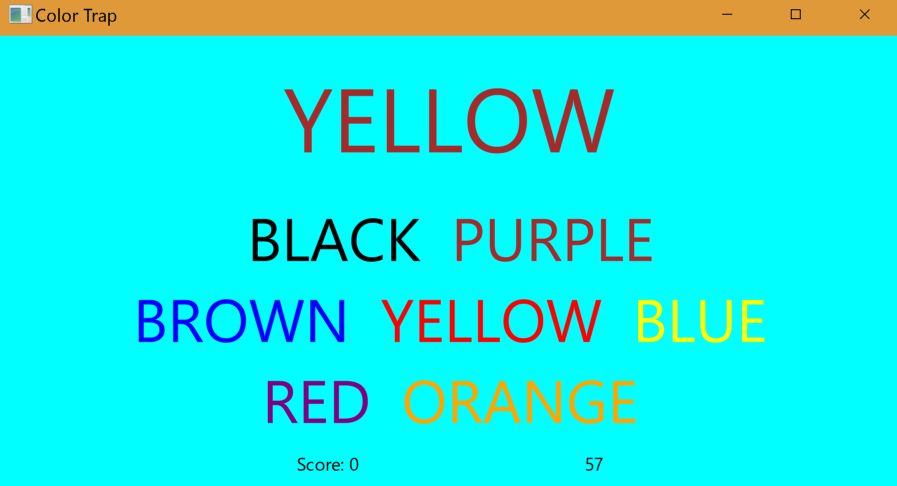

## ColorTrap Game

* This game is created in JavaFx.
* This game randomly selects a word from seven colors, filled with different color other than itself put it on top.
* Player has to click on the color name trapWord filled with from seven options.
* Player is given certain amount of time and for each match one point is given.
* End of the game, score is shown and the player is given the option to play again or quit.

* Below is a UI produced by the program.

 
 
